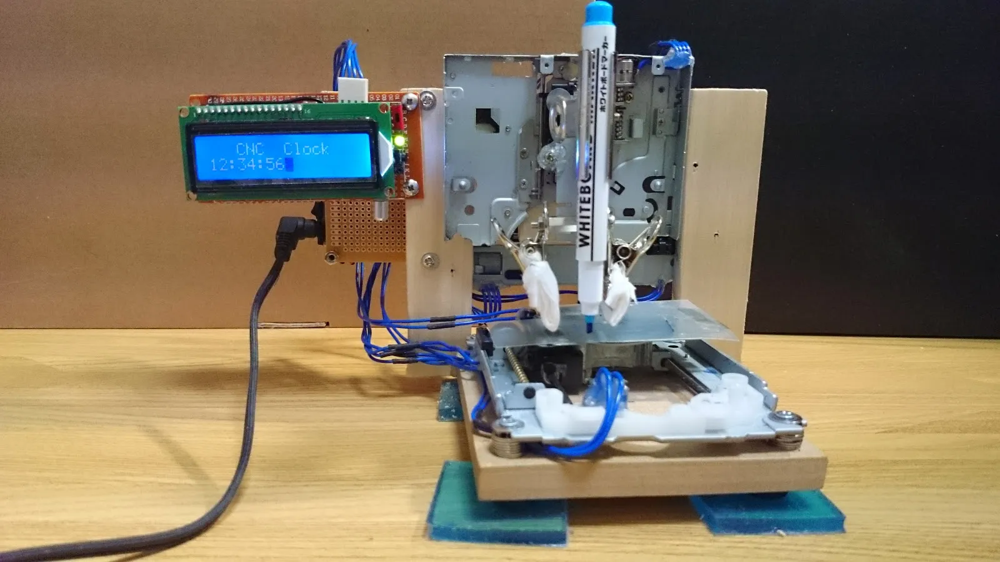

# CNC Clock

Inspired by Tony Stark's resourcefulness in Iron Man, this repo showcases my journey during an exchange year in Tokyo at UEC. Using salvaged parts from a 3C recycling hub, I crafted a CNC machine that functions as a rugged, industrial-style clock. Armed with minimal tools and an abundance of determination, this project is a testament to innovation through constraint. Dive in to witness the blend of old-school tech and sheer willpower!

[Blog](https://about.armcortex.cc/post/cnc-clock/)

